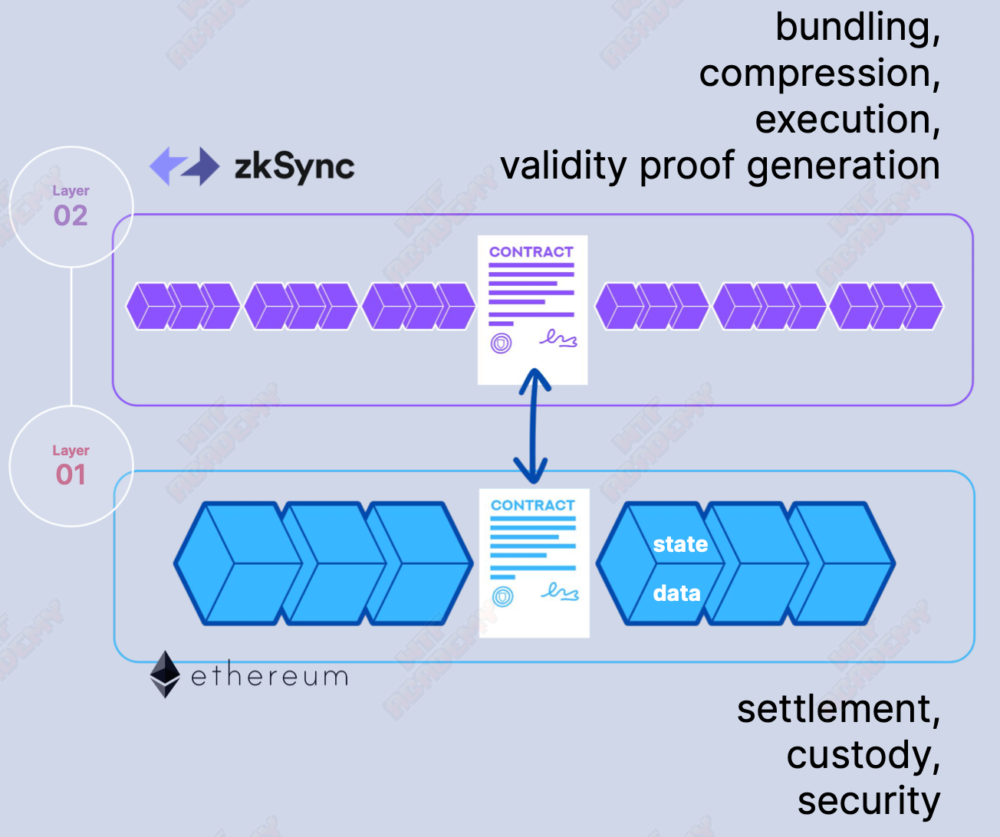

# WTF zkSync极简入门: 2. zkSync 基础

这个系列教程帮助开发者入门 zkSync 开发。

推特：[@0xAA_Science](https://twitter.com/0xAA_Science)｜[@WTFAcademy_](https://twitter.com/WTFAcademy_) 

社区：[Discord](https://discord.gg/5akcruXrsk)｜[微信群](https://docs.google.com/forms/d/e/1FAIpQLSe4KGT8Sh6sJ7hedQRuIYirOoZK_85miz3dw7vA1-YjodgJ-A/viewform?usp=sf_link)｜[官网 wtf.academy](https://wtf.academy) 所有代码和教程开源在 github: [github.com/WTFAcademy/WTF-zkSync](https://github.com/WTFAcademy/WTF-zkSync)

---

这一讲，我们将介绍 zkSync 相关的基础知识。

## 1. zkSync 背景和发展

### 1.1 什么是 zkSync

zkSync 是以太坊的第二层（Layer 2）扩展解决方案，zkSync 构建在 ZK Rollup 架构之上，通过将大量交易批量处理并将结果提交到以太坊主链来实现高性能和低成本的交易。

### 1.2 zkSync 工作原理

zkSync是一种基于以太坊的二层扩容解决方案，它利用了零知识证明技术来提高交易吞吐量和降低交易成本。zkSync属于目前以太坊比较流行的扩容方案ZK-Rollup的一种。ZK-Rollup 是基于零知识证明的Layer2扩容方案，采用有效性验证方法(VP)，默认所有交易都是不诚实的，只有通过有效性验证才会被接受。ZK-Rollup在链下进行复杂的计算和证明的生成，链上进行证明的校验并存储部分数据保证数据可用性。

### 1.3 zkSync 团队

zkSync 背后的公司 [Matter labs](https://matter-labs.io/)  总部位于德国，由 Alex Gluchowski 于 2018 年创立，并迅速发展到拥有 50 多名员工。该团队由经验丰富的区块链开发人员、研究人员和企业家组成，他们齐心协力创造一种更高效、更具成本效益且更安全的以太坊交易方式。以下是一些核心成员：

- Alex Gluchowski：Matter Labs的联合创始人和CEO，是zkSync项目的主要负责人之一，拥有丰富的区块链和密码学经验。

- Alex Vlasov：Matter Labs的联合创始人和CTO，是zkSync项目的主要技术负责人之一，拥有深厚的技术背景和丰富的经验。

- Dmitry Khovratovich：Matter Labs的首席科学家，是密码学领域的知名专家之一，曾在多个国际密码学会议上发表过重要的论文。

团队的融资信息如下：

- 2019/09，种子轮融资200万美元。
- 2021/02，A轮融资600万美元（Binance、Aave、Curve 和 Coinbase Ventures）。
- 2021/11，B轮融资5000万美元（a16z Crypto 领投）。
- 2022/01，融资2亿美元（BitDAO）。
- 2022/11，C轮融资2亿美元（Dragonfly 和 Blockchain Capital 领投）。

### 1.4 zkSync1.0、zkSync2.0

- zkSync1.0 ( `zkSync Lite` )：于2020年6月在以太坊主网上启动，zkSync1.0 是 zkSync 的轻量级版本，它提供了简化的支付和资产转移场景。但是它并不兼容以太坊虚拟机（EVM）。
- zkSync2.0 ( `zkSync Era` )：于2023年3月启动，zkSync2.0 对比 1.0 最大的特点就是兼容 EVM，可以执行 Solidity 或以太坊开发中使用的其他高级语言编写的智能合约，极大的降低了开发成本。

1.0和2.0的主要区别如下：

- 智能合约

  - zkSync 1.0提供了简化的支付和资产转移场景，并不支持以太坊虚拟机兼容的智能合约。

  - zkSync 2.0提供了对 EVM 兼容智能合约的完全支持，开发者可以在zkSync 2.0上轻松地部署以太坊智能合约 。

- 账户抽象

  - zkSync 2.0 提供了账户抽象的新功能，允许用户使用任何签名方案与智能合约进行交互，简化了用户和智能合约之间的交互，从而提高了用户体验。

- 可组合性

  - zkSync 1.0 仅支持有限的跨合约交互

  - zkSync 2.0 通过保留关键 EVM 功能（如智能合约可组合性）提高了协议间互操作性，这使得 zkSync 2.0 更适合构建复杂的去中心化金融（DeFi）应用程序。

- 开发工具
  - zkSync 2.0 配备了包括 CLI（命令行界面）和 SDK（软件开发工具包）等开发者工具，使开发者能够更轻松地构建和部署基于 zkSync 的应用程序。

## 2. zkSync 的优势

### 2.1 安全性

zkSync 使用零知识证明技术，确保了交易的安全性。zkSync 的安全模型不依赖于欺诈证明或博弈论，而是建立在独特的安全机制之上。这种模型达到以太坊主网级别的安全，为用户提供高度可信的交易环境。

### 2.2 兼容 EVM

zkSync Era 可以处理几乎所有基于以太坊虚拟机（EVM）的智能合约。在保证高安全的前提下，极大的降低了开发和维护成本。

### 2.3 抽象账户

zkSync Era 是第一个实现原生账户抽象的 EVM 兼容链。其账户可以发起交易，如EOA，但也可以在其中实现任意逻辑，如智能合约。并且通过引入智能帐户和 Paymaster 的概念，从根本上改变了帐户的操作方式。智能帐户是完全可编程的，允许进行各种自定义，例如签名方案、本机多重签名功能、支出限制和特定于应用程序的限制。Paymaster 可以为用户赞助交易，使用户能够用 ERC20 代币支付交易费用。这种创新的账户管理方法显着增强了用户体验、安全性和灵活性，为更广泛采用区块链技术铺平了道路。

## 3. 连接 zkSync 网络

zkSync 支持以太坊网络的钱包，比如 MetaMask。你只需要在钱包添加网络。

### 3.1 zkSync 主网

- Network Name: `zkSync Era Mainnet`
- RPC URL: `https://mainnet.era.zksync.io`
- Chain ID: `324`
- Currency Symbol: `ETH`
- Block Explorer URL: `https://explorer.zksync.io/`

### 3.2 zkSync Sepolia 测试网

- Network Name: `zkSync Era Sepolia Testnet`
- RPC URL: `https://sepolia.era.zksync.dev`
- Chain ID: `300`
- Currency Symbol: `ETH`
- Block Explorer URL: `https://sepolia.explorer.zksync.io/`

## 4. 桥接资产

你可以使用[zkSync官方跨链桥](https://portal.zksync.io/bridge/)或[第三方跨链桥](https://zksync.io/explore#bridges)将资产（ETH或ERC20）从以太坊主网存款到zkSync主网，或从zkSync提款到L1。

从以太坊主网存款到zkSync大约需要 15 分钟，而从zkSync提款到以太坊则最多需要 24 小时。

开发者也可以利用zkSync在L1和L2的跨链桥合约，搭建自定义跨链桥，[文档](https://docs.zksync.io/build/developer-reference/bridging-asset.html#withdrawals-to-l1)。

## 5. 区块浏览器

[zkSync Era Block Explorer](https://explorer.zksync.io/) 提供 zkSync 网络上所有交易、区块、合约等信息。你也可以使用第三方的区块链浏览器，比如 [etherscan](https://era.zksync.network/) 等。

## 6. 交易状态

zkSync的rollup操作指由L2上的rollup账户在rollup内部发起的交易。所有rollup交易都需要操作员（operator）的处理，操作员将所有交易打包，计算正确状态转换的零知识证明，并通过与L1的 Rollup 合约交互进行最终的状态转换。

zkSync rollup操作生命周期如下：

1. 用户在L2上创建交易，例如在钱包确认了一笔交易。
2. 操作员处理此请求后，创建一个rollup交易并将其添加到块中。
3. 一旦区块完成，运营商将其作为区块承诺提交给 zkSync 智能合约，利用智能合约检查rollup操作的部分逻辑。
4. 区块的证明将被提交给 zkSync 智能合约作为区块验证。如果验证成功，新状态会被视为最终状态。

## 7. 原生抽象账户

zkSync Era是第一个实现原生账户抽象（Account Abstraction）的 EVM 兼容链。

在传统的以太坊生态中，账户分为外部拥有账户（Externally Owned Accounts, EOAs）和合约账户。EOAs由私钥控制，而合约账户则由部署在其中的代码控制。这种设计虽然简单有效，但在某些情况下限制了可操作性和灵活性。

zkSync的原生账户抽象允许每个账户都能像智能合约一样拥有自己的逻辑。这意味着用户可以直接在他们的账户内部实现自定义逻辑，比如自动化的支付、权限管理、多重签名等，而无需通过外部合约或服务。

原生账户抽象有许多优势：

- **更高的安全性与灵活性**: 通过在账户级别直接实现自定义逻辑，用户可以创建更安全、更符合需求的账户模型。

- **简化用户体验**: 账户抽象简化了用户与区块链互动的复杂度。用户不再需要管理多个合约地址或理解智能合约的复杂性，就可以直接从他们的账户进行高级操作。

- **促进创新**: 原生账户抽象开辟了一片新的可能性空间，开发者可以利用这一特性创造前所未有的DApps和数字资产管理策略。

zkSync提供了一系列模版和工具帮助开发者基于账户抽象进行开发，我们将在后面的课程详细介绍。

## 8. 在 zkSync 上开发

开发者可以在zkSync上利用Solidity或Vyper开发智能合约，大部分合约可以无缝从主网迁移到zkSync上。并且，zkSync提供了定制化的hardhat和foundry帮助开发者编写智能合约。但是由于zkSync是第4类zkEVM，因此并不完全兼容L1的智能合约。我们会在之后的课程中详细讲解两者的不同，这里仅举几个例子：

- 转账时使用 `call` 而不是 `transfer` 或 `send`：`transfer` 和 `send` 函数限制了发送ETH时的gas消耗，上限为 `2300 gas`。而zkSync的账户都是智能合约，转账时消耗可能因为超出 `2300`，导致交易失败。因此，智能合约应使用没有gas消耗上限的`call`。

- 使用可升级合约：zkSync Era还在开发早期，虽然团队进行了广泛的测试来确保EVM兼容性，但问题仍然可能会出现。因此，部署合约时应尽量使用可升级的代理合约，应对可能发生的问题。如果你不了解代理合约/可升级合约，可以参考 WTF Solidity 教程[第48讲](https://github.com/AmazingAng/WTF-Solidity/blob/main/48_TransparentProxy/readme.md)和[49讲](https://github.com/AmazingAng/WTF-Solidity/blob/main/49_UUPS/readme.md)。

- 不要依赖EVM的gas逻辑：zkSync有一套自己的gas逻辑，与L1不同，比如会考虑数据发布在L1时的gas消耗。

## 9. 总结

这一讲，我们简单介绍了zkSync。zkSync Era是一个强大的以太坊二层扩容解决方案，提供高性能、低成本、EVM兼容性和原生账户抽象。开发者可以在zkSync上利用Solidity或Vyper开发智能合约，但是要注意它与以太坊的区别。我们会在之后的课程中更深入的学习如何在zkSync上进行开发。
