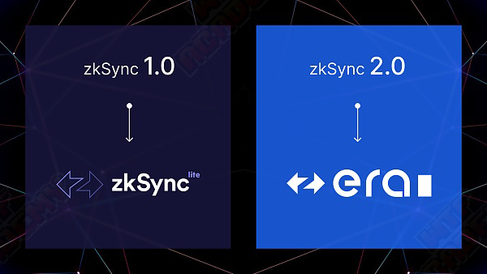
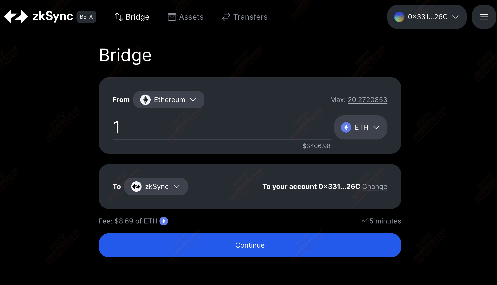

# WTF zkSync: 2. zkSync Basics

This series of tutorials aim to onboard developers to zkSync ecosystem.

Twitter: [@0xAA_Science](https://twitter.com/0xAA_Science)｜[@WTFAcademy_](https://twitter.com/WTFAcademy_)

Community: [Discord](https://discord.gg/5akcruXrsk)｜[WeChat Group](https://docs.google.com/forms/d/e/1FAIpQLSe4KGT8Sh6sJ7hedQRuIYirOoZK_85miz3dw7vA1-YjodgJ-A/viewform?usp=sf_link) |[Official website wtf.academy](https://wtf.academy) 

All codes and tutorials are open source on Github: [github.com/WTFAcademy/WTF-zkSync](https://github.com/WTFAcademy/WTF-zkSync)

---

In this lecture, we will introduce the basic knowledge related to zkSync.

## 1. zkSync background and development

### 1.1 What is zkSync

zkSync is Ethereum's second layer (Layer 2) extension solution. zkSync is built on the ZK Rollup architecture to achieve high-performance and low-cost transactions by batch processing a large number of transactions and submitting the results to the Ethereum main chain.

### 1.2 How zkSync works

zkSync is a second-layer scaling solution based on Ethereum that utilizes zero-knowledge proof technology to increase transaction throughput and reduce transaction costs. zkSync is a type of ZK-Rollup, a popular expansion solution in Ethereum. ZK-Rollup is a Layer 2 expansion solution based on zero-knowledge proof. It adopts the validity verification method (VP). By default, all transactions are dishonest and will only be accepted if they pass validity verification. ZK-Rollup performs complex calculations and proof generation off-chain, and performs proof verification and stores part of the data on-chain to ensure data availability.

### 1.3 zkSync Team

[Matter labs](https://matter-labs.io/), the company behind zkSync, is based in Germany and was founded by Alex Gluchowski in 2018 and has quickly grown to over 50 employees. The team is comprised of experienced blockchain developers, researchers, and entrepreneurs who have come together to create a more efficient, cost-effective, and secure way to transact on Ethereum. Here are some core members:

- Alex Gluchowski: Co-founder and CEO of Matter Labs, one of the main leaders of the zkSync project, and has extensive experience in blockchain and cryptography.

- Alex Vlasov: Co-founder and CTO of Matter Labs, he is one of the main technical leaders of the zkSync project and has a deep technical background and rich experience.

- Dmitry Khovratovich: Chief Scientist of Matter Labs, he is one of the well-known experts in the field of cryptography and has published important papers at many international cryptography conferences.

The team’s financing information is as follows:

- 2019/09, seed round financing of US$2 million.
- 2021/02, $6 million in Series A funding (Binance, Aave, Curve and Coinbase Ventures).
- 2021/11, Series B financing of US$50 million (a16z Crypto led the investment).
- 2022/01, raising $200 million (BitDAO).
- 2022/11, Series C financing of US$200 million (led by Dragonfly and Blockchain Capital).

### 1.4 zkSync1.0, zkSync2.0

- zkSync 1.0 (`zkSync Lite`): Launched on the Ethereum mainnet in June 2020, zkSync1.0 is a lightweight version of zkSync that provides simplified payment and asset transfer scenarios. But it is not compatible with the Ethereum Virtual Machine (EVM).
- zkSync 2.0 (`zkSync Era`): Launched in March 2023, the biggest feature of zkSync 2.0 compared to 1.0 is that it is compatible with EVM and can execute smart contracts written in Solidity or other high-level languages ​​used in Ethereum development, greatly reducing the cost development costs.

   The main differences between 1.0 and 2.0 are as follows:

- Smart contracts

   - zkSync 1.0 provides simplified payment and asset transfer scenarios and does not support Ethereum Virtual Machine-compatible smart contracts.

   - zkSync 2.0 provides full support for EVM-compatible smart contracts, and developers can easily deploy Ethereum smart contracts on zkSync 2.0.

- Account abstraction

   - zkSync 2.0 provides new features of account abstraction, allowing users to interact with smart contracts using any signature scheme, simplifying the interaction between users and smart contracts, thereby improving user experience.

- Composability

   - zkSync 1.0 only supports limited cross-contract interaction

   - zkSync 2.0 improves inter-protocol interoperability by retaining key EVM features such as smart contract composability, which makes zkSync 2.0 more suitable for building complex decentralized finance (DeFi) applications.

- development tools
   - zkSync 2.0 comes with developer tools including CLI (Command Line Interface) and SDK (Software Development Kit), making it easier for developers to build and deploy zkSync-based applications.
    
- Precompiled
   - zkSync 2.0 supports precompiled contracts for the Shanghai protocol version including ecrecover and sha256 (plus keccak256) as well as lambdaclass being developed, i.e. ecAdd, ecMul and modexp (plus ecPairing).

## 2. Advantages of zkSync

### 2.1 Security

zkSync uses zero-knowledge proof technology to ensure transaction security. zkSync's security model does not rely on fraud proofs or game theory, but is built on unique security mechanisms. This model achieves Ethereum mainnet-level security and provides users with a highly trusted trading environment.

### 2.2 Compatible with EVM

zkSync Era can handle almost all smart contracts based on the Ethereum Virtual Machine (EVM). On the premise of ensuring high security, development and maintenance costs are greatly reduced.

### 2.3 Abstract account

zkSync Era is the first EVM-compatible chain to implement native account abstraction. Its account can initiate transactions, such as EOA, but can also implement arbitrary logic in it, such as smart contracts. And by introducing the concepts of Smart Accounts and Paymaster, it fundamentally changes the way accounts are operated. Smart Accounts are fully programmable, allowing for a variety of customizations such as signature schemes, native multi-signature capabilities, spending limits, and application-specific restrictions. Paymaster can sponsor transactions for users, enabling users to pay transaction fees with ERC20 tokens. This innovative approach to account management significantly enhances user experience, security and flexibility, paving the way for wider adoption of blockchain technology.

## 3. Connect to zkSync network

zkSync supports wallets on the Ethereum network, such as MetaMask. You just need to add the network to your wallet.

### 3.1 zkSync mainnet

- Network Name: `zkSync Era Mainnet`
- RPC URL: `https://mainnet.era.zksync.io`
-Chain ID: `324`
- Currency Symbol: `ETH`
- Block Explorer URL: `https://explorer.zksync.io/`

### 3.2 zkSync Sepolia test network

- Network Name: `zkSync Era Sepolia Testnet`
- RPC URL: `https://sepolia.era.zksync.dev`
-Chain ID: `300`
- Currency Symbol: `ETH`
- Block Explorer URL: `https://sepolia.explorer.zksync.io/`

## 4. Bridging assets

You can use [zkSync official cross-chain bridge](https://portal.zksync.io/bridge/) or [third-party cross-chain bridge](https://zksync.io/explore#bridges) to transfer assets (ETH or ERC20) like depositing from Ethereum mainnet to zkSync mainnet, or withdrawing from zkSync to L1.

Deposits from Ethereum mainnet to zkSync take approximately 15 minutes, while withdrawals from zkSync to Ethereum can take up to 24 hours.

Developers can also use zkSync's cross-chain bridge contracts in L1 and L2 to build custom cross-chain bridges, [Document](https://docs.zksync.io/build/developer-reference/bridging-asset.html#withdrawals -to-l1).

## 5. Block explorer

[zkSync Era Block Explorer](https://explorer.zksync.io/) provides all transactions, blocks, contracts and other information on the zkSync network. You can also use a third-party blockchain browser, such as [etherscan](https://era.zksync.network/), etc.

## 6. Transaction status

The rollup operation of zkSync refers to the transaction initiated within the rollup by the rollup account on L2. All rollup transactions require processing by an operator, which packages all transactions, calculates a zero-knowledge proof of the correct state transition, and performs the final state transition by interacting with the L1 Rollup contract.

The zkSync rollup operation life cycle is as follows:

1. The user creates a transaction on L2, for example, confirms a transaction in the wallet.
2. After the operator handles this request, it creates a rollup transaction and adds it to the block.
3. Once the block is completed, the operator submits it as a block commitment to the zkSync smart contract, using the smart contract to check part of the logic of the rollup operation.
4. The proof of the block will be submitted to the zkSync smart contract as block verification. If the verification is successful, the new state is considered final.

## 7. Native abstract account

zkSync Era is the first EVM-compatible chain to implement native account abstraction.

In the traditional Ethereum ecosystem, accounts are divided into externally owned accounts (EOAs) and contract accounts. EOAs are controlled by private keys, while contract accounts are controlled by the code deployed within them. Although this design is simple and effective, it limits operability and flexibility in some situations.

zkSync's native account abstraction allows each account to have its own logic like a smart contract. This means that users can implement custom logic, such as automated payments, permission management, multi-signatures, etc., directly within their accounts without going through external contracts or services.

Native account abstraction has many advantages:

- **Higher Security and Flexibility**: By implementing custom logic directly at the account level, users can create account models that are more secure and more in line with their needs.

- **Simplified User Experience**: Account abstraction simplifies the complexity of user interaction with the blockchain. Users no longer need to manage multiple contract addresses or understand the complexities of smart contracts to perform advanced operations directly from their accounts.

- **Foster Innovation**: Native account abstraction opens up a new space of possibilities, allowing developers to create unprecedented DApps and digital asset management strategies.

zkSync provides a series of templates and tools to help developers develop based on account abstraction, which we will introduce in detail in later courses.

## 8. Develop on zkSync

Developers can use Solidity or Vyper to develop smart contracts on zkSync, and most contracts can be seamlessly migrated from the main network to zkSync. Moreover, zkSync provides customized Hardhat and Foundry to help developers write smart contracts. However, since zkSync is a type 4 zkEVM, it is not fully compatible with L1 smart contracts. We will explain the differences between the two in detail in subsequent courses, but here are just a few examples:

- Use `call` instead of `transfer` or `send` when transferring: The `transfer` and `send` functions limit the gas consumption when sending ETH, with an upper limit of `2300 gas`. The zkSync accounts are all smart contracts, and the consumption during transfer may exceed `2300`, causing the transaction to fail. Therefore, smart contracts should use `call` without an upper limit on gas consumption.

- Use upgradable contracts: The zkSync Era is still in the early stages of development, and although the team has conducted extensive testing to ensure EVM compatibility, issues may still arise. Therefore, when deploying contracts, you should try to use upgradable proxy contracts to deal with possible problems. If you don’t understand proxy contracts/upgradeable contracts, you can refer to the WTF Solidity tutorial [Lecture 48](https://github.com/AmazingAng/WTF-Solidity/blob/main/48_TransparentProxy/readme.md) and [Lecture 49 ](https://github.com/AmazingAng/WTF-Solidity/blob/main/49_UUPS/readme.md).

- Do not rely on EVM's gas logic: zkSync has its own set of gas logic, which is different from L1. For example, it will consider the gas consumption when data is published in L1. For details, please refer to [Document](https://docs.zksync.io/zk -stack/concepts/fee-mechanism.html).

## 9. Summary

In this lecture, we briefly introduce zkSync. zkSync Era is a powerful Ethereum Layer 2 scaling solution that provides high performance, low cost, EVM compatibility and native account abstraction. Developers can use Solidity or Vyper to develop smart contracts on zkSync, but be aware of the differences from Ethereum. We will learn more about how to develop on zkSync in subsequent courses.
