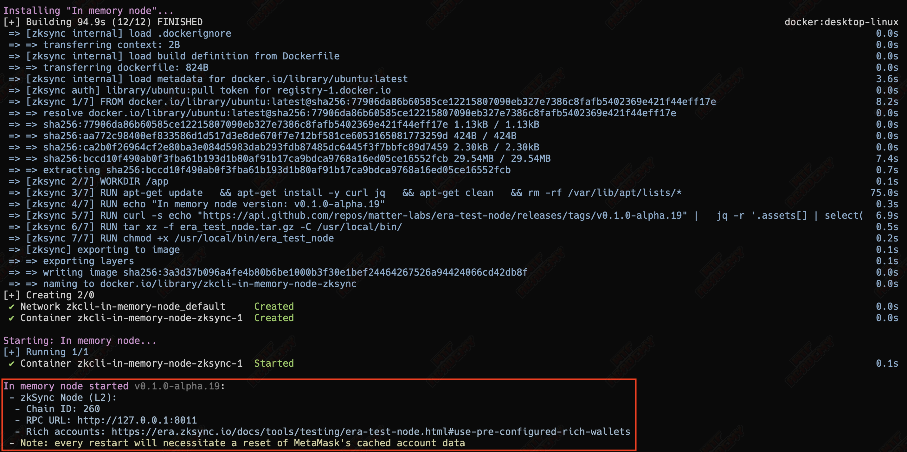
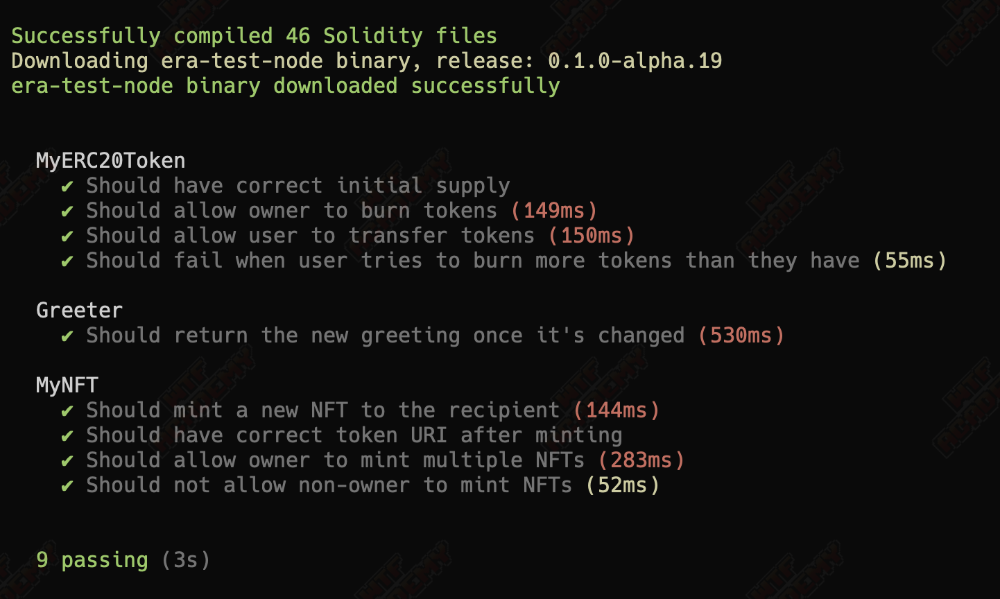

# WTF zkSync minimalist introduction: 6. Contract testing

This series of tutorials helps developers get started with zkSync development.
Twitter: [@0xAA_Science](https://twitter.com/0xAA_Science)｜[@WTFAcademy\_](https://twitter.com/WTFAcademy_) Community: [Discord](https://discord.gg/ 5 akcru academy) All codes and tutorials are open source on github: [github.com/WTFAcademy/WTF-zkSync](https://github.com/WTFAcademy/WTF-zkSync)

---

When developing a zkSync contract, writing test programs is a key step in verifying the correctness of the contract logic. This tutorial will walk you through how to write tests in zkSync.

## Preparation

Before starting zkSync testing, let's first understand the basic testing of evm smart contracts. Please make sure you have configured the test environment. You need to install Node.js, NPM and [Hardhat](https://hardhat.org/hardhat-runner/docs/getting-started), an Ethereum development environment that allows you to compile, deploy and test your Smart contracts.

If you haven't installed Hardhat yet, you can install it with the following command:

```shell
npm install -D hardhat
```

Next, create a new Hardhat project:

```shell
npx hardhat
```


After completing the project settings according to the prompts, some new directories will be automatically generated in your working directory, such as: `contracts`, `test`. Your basic development environment is ready.

##Write smart contracts

Create a new Solidity smart contract file `MyContract.sol` in the `contracts` folder. Here, we will simply write a contract that stores and updates numbers as an example:

```solidity
// SPDX-License-Identifier: MIT
pragma solidity ^0.8.0;

contract MyContract {
     uint public myNumber;

     function setMyNumber(uint _myNumber) external {
         myNumber = _myNumber;
     }

     function getMyNumber() external view returns (uint) {
         return myNumber;
     }
}
```

## Write test program

Testing a written smart contract is an important step to ensure that it works as expected. Hardhat uses Mocha testing framework and Waffle assertion library to write tests. In the `test` folder, create a new test file `MyContract.test.js`.

```javascript
const { expect } = require("chai");
const { ethers } = require("hardhat");

describe("MyContract", function () {
   it("Should return the new number once it's changed", async function () {
     const MyContract = await ethers.getContractFactory("MyContract");
     const myContract = await MyContract.deploy();
     await myContract.waitForDeployment();

     const setTx = await myContract.setMyNumber(7);

     // Wait for transaction to complete
     await setTx.wait();

     expect(await myContract.getMyNumber()).to.equal(7);
   });
});
```

This test code may seem a bit complicated at first, but its steps can be simply divided into:

1. Deploy the contract.
2. Call the `setMyNumber` function to update the status.
3. Wait for the function call to complete running in the chain environment simulated by `hardhat`.
4. Call `getMyNumber` to get the latest value and check whether it is as expected. The `expect` method is an auxiliary method provided by [chai](https://www.chaijs.com/api/). Please refer to the detailed usage method. its documentation.

## Execute test

Once everything is ready, you can execute the test by running the following command:

```shell
npx hardhat test
```

When the test passes successfully, you'll see a green checkbox and the test passed message, indicating that your contract is working as expected.


## zkSync related tests

### Preparation

In the zkSync test, you need to use the `zksync-cli` command. The first time you use this command, it will ask you whether you want to install it. Just answer `y`.


We will use this command to start a local zkSync running environment, including a temporary zkSync `In-Memory` node. The operation of this node requires `docker`, so you must have `docker` installed locally in advance, [ Download and install](https://www.docker.com/products/docker-desktop/). (`docker` is an application container. If you are exposed to it for the first time, just think of it as a virtual machine. There is no need to go into details, because the `zksync-cli` command will help us shield the usage details. If you are interested Friends, you can explore [docker](https://www.docker.com) by yourself

### Start the test environment

After ensuring that docker is running normally, use the `npx zksync-cli dev start` command to start a running environment. Select the `In-Memory` node as the startup node type. There is no need to add any additional modules.


When you start it for the first time, a docker image will be created first, and you can wait for the operation to complete. After the operation is completed, your temporary node will run in the background, and you will get an RPC connection address of the local zkSync chain.



### Create test

Use the `npx zksync-cli create test-demo` command to create a template test project named `test-demo`. When the command is run, you will be asked about the test type and the framework to be used. Just choose according to your preference.


Here I will choose `npm` as the dependency manager of the project, use `HardHat` + `Solidity` for development and testing, and I will choose the v6 version of the `ethers` library.

In the `test-demo` directory, you will see many new folders. Like the previous basic tests, the contract code files are in the `contracts` directory, and the tests that need to be run are in the `test` directory.

Next, run the following two lines of commands to install the third-party libraries that the project depends on, and add an additional zkSync data test tool package

```
npm install
npm install -D @matterlabs/hardhat-zksync-chai-matchers @nomicfoundation/hardhat-chai-matchers @nomiclabs/hardhat-ethers
```

Then you need to add the following line of code to the `hardhat.config.ts` file header to add support for zkSync to chai.

```
import "@matterlabs/hardhat-zksync-chai-matchers";
```

Finally, run `npm test` to start the test. All test files in the `test` directory will be run. (`zksolc` and `solc` will be downloaded when starting for the first time. If you wait for too long to download, please solve the network problem by yourself)



## Test using Foundry-zksync

foundry-zksync is a Foundry branch customized specifically for zkSync. It extends Foundry's capabilities in Ethereum application development to support zkSync, allowing compilation, deployment, testing, and interaction with smart contracts on zkSync. foundry-zksync introduces zkforge and zkcast extensions of Foundry's existing forge and cast tools, but is designed specifically for use with zkSync.

### Preparation

[foundry-zksync](https://github.com/matter-labs/foundry-zksync) is a specialized branch of Foundry, tailored for zkSync. It extends Foundry's capabilities for Ethereum application development to support zkSync, allowing compilation, deployment, testing, and interaction with smart contracts on zkSync. foundry-zksync introduces extensions to Foundry's existing forge and cast tools - zkforge and zkcast - customized for use with zkSync.

Installing foundry-zksync requires the following steps:

1. Clone the repository:

```shell
git clone git@github.com:matter-labs/foundry-zksync.git
```

2. Enter the foundry-zksync directory and switch to the master branch:

```shell
cd foundry-zksync && git checkout main
```

3. Install zkForge and zkCast:

```shell
cargo install --path ./crates/zkforge --profile local --force --locked
cargo install --path ./crates/zkcast --profile local --force --locked
```

### Create test

After the installation is complete, use `zkforge init test-demo` to initialize a new project, which will set up the basic structure of the new Foundry project

Enter the project directory and run `zkforge test` to execute the test and you will see the test results.

Or use

```shell
zkforge test --match-contract CounterTest --match-test test_Increment
```

Filter by contract or test name to run specific tests

### Deploy the contract to the zkSync sepolia testnet

Create a new contract file `Greeter.sol` in the src directory with the following content:

```solidity
//SPDX-License-Identifier: Unlicense
pragma solidity ^0.8.0;

contract Greeter {
     string private greeting;

     constructor(string memory _greeting) {
         greeting = _greeting;
     }

     function greet() public view returns (string memory) {
         return greeting;
     }

     function setGreeting(string memory _greeting) public {
         greeting = _greeting;
     }
}
```

To compile:

```shell
zkforge zkbuild --is-system=true --use 0.8.13 --use-zksolc v1.4.0
```

Deploy smart contracts on the chain:

```shell
zkforge zkcreate src/Greeter.sol:Greeter --constructor-args "Hello zkSync" --private-key <your wallet private key> --rpc-url https://sepolia.era.zksync.dev --chain 300
```

As shown in the figure, the contract deployment is successful:


The contract address is: `0x5922031e08e04847d62ebd09682fd7cf42ecc80f`

Use `zkcast` to interact with the contract:

```shell
zkcast call <contract address> "greet()(string)" --rpc-url https://sepolia.era.zksync.dev --chain 300
```

As shown in the figure, the call is successful:


## Summarize

Writing tests is an important part of smart contract development, especially when your contract logic becomes complex. This tutorial briefly introduces how to write and execute tests in the zkSync contract development environment, and use foundry-zksync to deploy the contract to the zkSync test network. I hope this content can help you better understand zkSync's contract testing.
